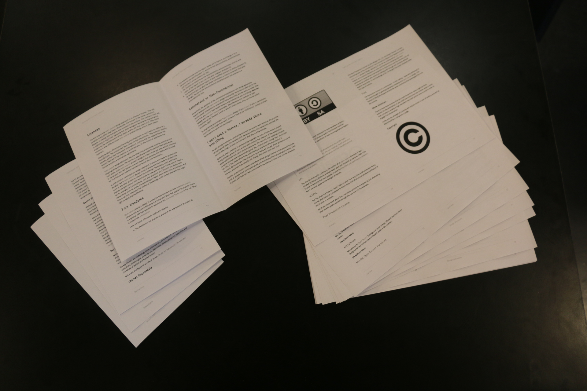
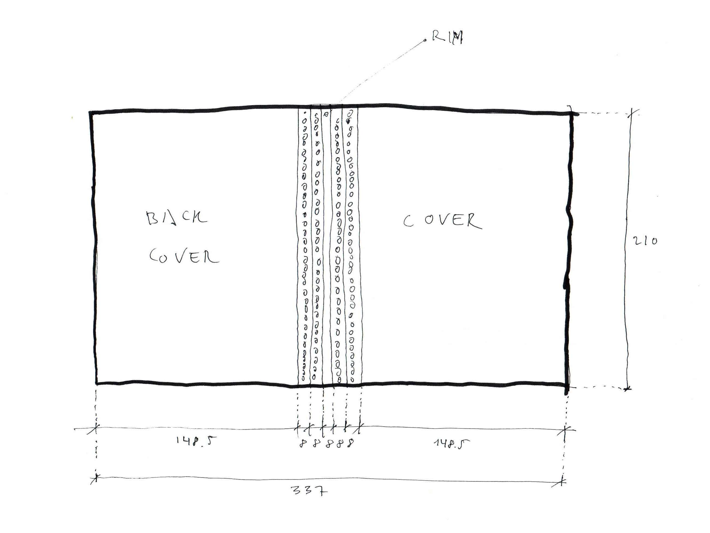
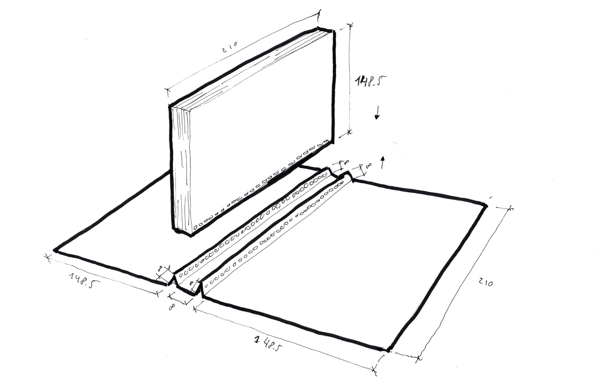
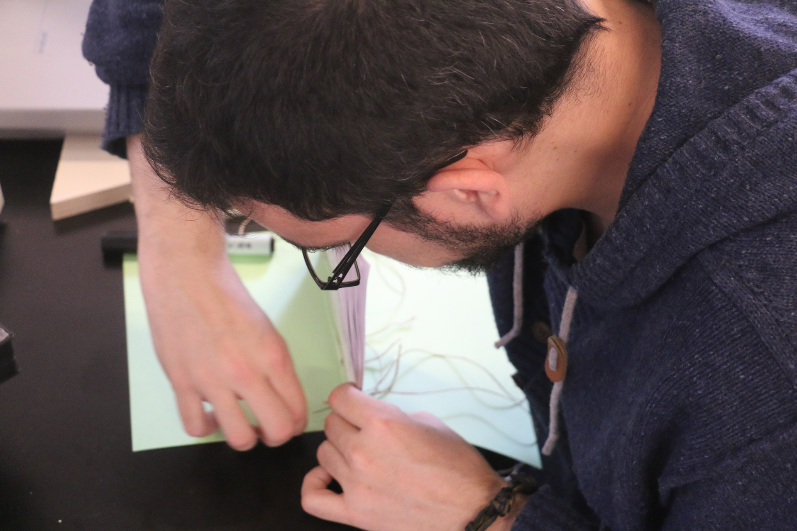

About this book
===========

This book was initiated by Libre Objet and brought to life by a collective of creators and authors during [Interactivos?'15](http://comunidad.medialab-prado.es/en/groups/open-guide-open-objects) at Medialab Prado, Madrid.

The co-authors present at Medialab Prado were:

- Gaizka Altuna, architect researcher − http://m-etxea.com
- ginger coons, researcher − http://gingercoons.ca
- Julien Deswaef, media artist − http://xuv.be
- Mathieu Gabiot, product designer − http://mathieu-g.be
- César García, digital tech researcher - http://make.cesargarciasaez.com
- Øyvind Kolås, digital media toolsmith − http://pippin.gimp.org/
- Martin Lévêque, product designer − https://www.behance.net/martinleveque

This project could not have been possible without the support of Josian Llorente, Jara Rocha, Wendy Van Wynsberghe and the whole team at Medialab Prado.

This book is also liberated and published under the Free Art License 1.3. Which means that if you want to copy it, distribute it or modify it, you're more than welcome to do so, as long as you credit all the co-authors and
share it with the same license.
Although this is not required, we would be pleased if you sent us news, reviews, comments or any adaptation you make to it. Our email address is **hello@libreobjet.org**

The source files are available at {{ book.meta.source_url }}

This book has been compiled on {{ book.meta.compilation_date }} with Gitbook version {{ gitbook.version }}.

About the title
---------------
During the whole process of writing, many titles were proposed. Some were more pleasing than others. Some were funny. Some were rude. But somehow we could never settle for one.

Close to the end of the 2 weeks, while we were printing the first versions of it, Øyvind got confused by a typo in the book and made a word become "derived", although the initial author meant "diverted".

Those two words fitting nicely within the practice of free/libre open source design, it seemed a perfect fit for a catchy title with an alliterative twist, and so it's now named _Diverted Derived Design_.

Tools
-------
We used this toolchain of free/libre and open source softwares to bring the book to life.

### Etherpad
Etherpad is a browser based text editor that allows many people to write together in real-time on the same page.  
http://etherpad.org/

### Markdown
We used the markdown syntax as its very easy-to-write and easy-to-read plain text format can be converted in HTML while keeping it structured.   http://daringfireball.net/projects/markdown/

### Bash
Bash is a shell scripting language available on \*nix systems. A small bash script was used to download and regularly backup all the texts that were written in etherpads.  
https://www.gnu.org/software/bash/

### Git
Git, today's most famous version control system, was used to keep track of the text changes and to sync those with an online repository held at Github.   http://www.git-scm.com/

### Sparkleshare
Sparkleshare behaves a little like the infamous Dropbox, but uses a git repository as a back-end. Created by Hylke Bons, this tool made it easier to sync files and folders between computers, while keeping track of changes and without anyone needing to learn how Git works.  
http://sparkleshare.org/  

### Gitbook-cli
Gitbook-cli is an open source software based on Nodejs that transforms a set of markdown files and folders into different electronic book formats (pdf, epub, mobi, html).  
https://www.gitbook.com/

### Podofo
Podofo is a PDF manipulation toolbox of which Podofoimpose was used to produce a different imposition of the pdf for home printers.  
http://podofo.sourceforge.net/

### Fonts
We use these excellent libre fonts in the book:
 - TGL by Peter Wiegel released under the SIL Open Font License 1.1
 - Open Sans by Steve Matteson released under Apache License  2.0

Object
---------

There are a lot of ways of printing and binding this book. Below, we explain how we have made it. If you have a different way of doing it, you are, of course, free to do it your way.

We used this way of binding for making our prototypes during the workshop of Interactivos?'15. This version should be affordable for anyone and and requires only common tools.

Materials:

-DIN A4 sized folios (12-20, depending the version of the book)
-DIN A3 sized Cardboards
-A DIN A3 Printer
-A drill for spiral binding or a mini drill
-Thread
-A needle

#### Step 1

Print the book in booklet mode. You can use a software like Bookletimposer for sorting the pages in a correct way. Then, fold the folios and make the holes with the drill for spiral binding.

#### Step 2

Print the cover in a DIN A3 printer. The cover will be more or less 337x210 mm. You must divide the cover in seven strips. The size of this strips must be 148.5+8+8+8+8+8+148.5=337.

#### Step 3

Make holes with the drill for 2nd, 3rd, 5th and 6th strips and them fold them in the same way of the photograph.

#### Step 4

Sew all the pages with the cover.

#### Step 5
Enjoy the reading

Open Questions
-----------------------

- Have you found a mistake in this book?
- Would you like to translate it?

Illustrations
=============

This is the list of illustrations, photos and graphics available in book and their respective license.

  1. {{ picture.list_caption }}



