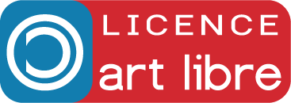
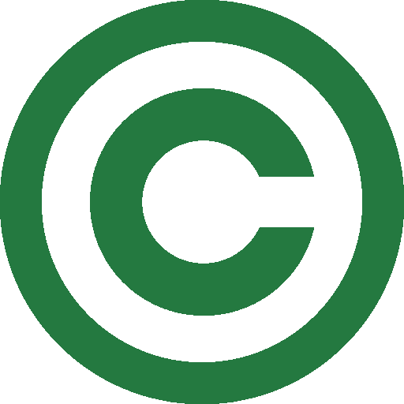
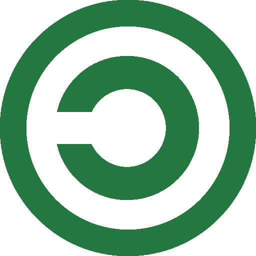

Licenses
=======

The first step in any open source design approach is to choose a license. This will condition every other step taken afterwards. The license is the social contract a designer is making with everyone else involved in the project. This contract, once set, is explicitely or implicitely signed by the other designers working on improving the project, by the manufacturers of the object and by the final users of it. This social contract is what differenciates open source product design from a more classic approach.

Usually designers think about licensing once they enter in touch with an editor or a manufacturer. This step comes then closer to the end process. This contract usually benefits parties that know each other while it restricts any use beyond those not directly involved in the creation or build process. In this classical approach, the license is mainly a commercial agreement.

Open source design addresses this the other way around and must be placed at the begining of the process. The license is specifically made for parties that don't know each other. As an open source product designer, I don't know yet who will be involved in my project, who will build it or even maybe what purpose the object will be used for. The license can address commercial terms, but not necessarly.

As with a classic contemporary design approach, licenses are made to protect the designer. But in open source design, these licences are also made to protect the users or any other preson in relation to the design. Nowadays, more and more objects are given to you with restrictions on how you can open it and own it. Take a car for example, or a smartphone. As a user you have very little to say about how those things work, let alone the possibility to repair them when they are broken. And this is not only related to the technical knowledge to do so but also with the legal right to apply any modification.

Four freedoms
--------------------

Open source product design is a practice that comes from free and open source software and as such is following the same principles, but applied to objects. There is a general rule that permits to determine if a licence is "open source" or not. Does it respect the [4 freedoms](http://www.gnu.org/philosophy/free-sw.html )?

Here are those 4 freedoms applied to objects:

1. The freedom to use objects as you wish, for any purpose (freedom 0).
2. The freedom to study how the object works, om to build it, and change it so it behaves as you wish (freedom 1). Access to the documentation, build processes and sources is a precondition for this.
3. The freedom to redistribute the documentation, build processes, sources and copies of the object so you can help your neighbor (freedom 2).
4. The freedom to distribute copies of your modified versions to others (freedom 3). By doing this you can give the whole community a chance to benefit from your changes. Access to the documentation, build processes and sources is a precondition for this.

Commercial or Non-Commercial
----------------------------------------------

Many times, the question of the commercial exploitation of a design generates heated debates in the open source design community. We'd like to refer you to the section about economics to understand more about this, but we want to make clear here that any licence that would prevent any commercial use of a design **does not comply** with the open source principles. Why? Because this conflicts or puts limitations on the freedom 2 and 3. And if it limits those, they can not be called freedoms, right?

So stop calling your project "open source design" if you licence it with a commercial restriction. You might then want to have a look at our "Definitions" section to find a better generic name for your project.

Is there an ideal or perfect license for open source objects?
-------------------------------------------------------------------------------------

Sorry to say this, but no. Although there is many open source licenses for software and some of those licenses might work for design documents, there is no magic solution that could work in any case. Remember that licenses are generally complex legal documents that try to cover as many cases as possible and that give guidelines on what is permitted or not. As we said, these are social contracts, and as such could be ideal in a particular situation, but be problematic in others. In the case of open source licenses, since these grant more freedoms than they restrict, they generally tend to create less problems than some others. Fortunately also, and as open source product design will become more and more popular, we can expect that licences will improve and adapt to the new conditions brought by our future societies.

Please, refer to the "tools" chapter of this section to have an overview of the licences available and their use cases.

Terms of use and liability
-----------------------------------

Usually, when you acquire an object, some terms of use define the cases for which the object has been thought for and limits the responsibility of the designer to those cases. It is commonly accepted that a designer is responsible for its creation and the quality of the objects being produced following his technical plans. In most countries, designs have to go through extensive testing and have to follow local regulations before being put on the market.

With open source product design, the responsibility is often transfered on the person receiving the documentation and are totally waived from the creator's hand by the license. As with open source software, documentation and objects being offered have no garantee of  usability, functionality or purpose of any kind and the final user shall not make the designer responsible of anything ever.

Because of this, if you intend to download, build and commercialize any open source object, you better check with your local regulation the implications of such practices and get an advice from a specialized lawyer.

Tools
-------

### [Free Art License](http://artlibre.org/licence/lal/en/ ) 

This is the prefered license used by Libre Objet members and Nonpareil. This license has been written by Antoine Moreau and friends and has originated in France. The F.A.L. is very easy to read and simple to understand. It has been written especially for works of art regardless of their type or expression and is respectful of the roman version of the author's right (as opposed to the english copyright)

### [Creative Commons](https://creativecommons.org/licenses/ ) 

Surprise, surprise! Creative Commons is not a license. **It's a set of licenses**. We often hear: "I publish my creations under Creative Commons." as this would instantly make you a nice person. It does not. Creative Commons proposes licenses that range from total freedom to no freedom at all. Fortunately, due to their popularity, you will find countless texts and studies that explain you the use of one or the other. Their widely use could be beneficial as more and more people understand them and their implications. If you care about restricting some right to your users, Creative Commons offer you those possibilities. Though remember, because of this, some of the Creative Commons licences are not open source. Here is the only ones that you can use for open source designs:  
- Attribution-Share Alike (CC-by-sa) 
- Attribution (CC-by)
- Public Domain Dedication (CC0)

### [TAPR License](http://www.tapr.org/ohl.html ) 
The Tapr Open Hardware License is a license dedicated to open hardware projects, usually electronics components involved in amateur radlio. This license could be applied to any objects and addresses the specificity of open sourcing physical object.

### [CERN](http://www.ohwr.org/projects/cernohl/wiki )
> In the spirit of knowledge sharing and dissemination, the CERN Open Hardware Licence (CERN OHL) governs the use, copying, modification and  distribution of hardware design documentation, and the manufacture and distribution of products.

### [GPL](https://gnu.org/licenses/gpl.html )
The Gnu General Public License is the mother of all open source licenses. It was created by Richard Stallman and has been used and released as early as 1989. This license is certainly the most popular license for free/libre and open source software, but it can also apply to the designs of objects.

### [WTFPL](http://www.wtfpl.net/ ) 
The "do What The Fuck you want Public License" is a very short and somewhat funny license that exists as a response to flame wars that often occur between partisans of one license or another.

### [Peer Production License](http://p2pfoundation.net/Peer_Production_License ) 
The Peer Production License by John Magyar, B.A., J.D. and Dmytri Kleiner is a very interesting take at the commercial / non-commercial debate that happens around open source product design. Basically, it can not be considered an open source license as it restricts freedoms on uses and distribution allowing only other commone rs, cooperatives and nonprofits to share and re-use the material, but not commercial entities who intent on making profit through the commons without explicit reciprocity. To our knowledge so far, no designs have been released under this type of license.

### [FabL](https://lite6.framapad.org/p/FABL-0.1-incub-COMMENTAIRES )
The Fabrication License is a new license − in the making − especially dedicated to the cases brought by growing popularity of fablabs and open source design. This license is being developped around the same community that developped the Free Art License.

### More licences...

There is many more licences that you could chose from. Some might be more suitable for documentation, or you could even write your own license. Keep in mind that a license is usually a legal document that both parties have to trust in order to engage in a collaboration.

In the end, the strength of a license will only be tested in case of conflicts and will be determined by a ruling from a judge.

### Copyright 

> Copyright  is a legal right created by the law of a country that  grants  the  creator of an original work exclusive rights for its use  and   distribution. This is usually only for a limited time. The  exclusive   rights are not absolute but limited by limitations and  exceptions to   copyright law, including fair use.

> Copyright  is a form of intellectual **property**, applicable to   certain forms of  **creative work**. Under US copyright law, legal   protection attaches  only to fixed    representations in a tangible med
%=ium. It is often shared among   multiple  authors, each of whom holds a set of rights to use or license   the work,  and who are commonly referred to as rightsholders. These   rights  frequently include reproduction, control over derivative  works,   distribution, public performance, and "moral rights" such as    attribution.

> Copyrights  are considered **territorial rights**, which means that    they do not  extend beyond the territory of a specific jurisdiction.    While many  aspects of national copyright laws have been standardized    through  international copyright agreements, copyright laws vary by   country. 
[Source Wikipedia](https://en.wikipedia.org/wiki/Copyright)

### Copyleft 

> Copyleft (a play on the word copyright)    is the practice of offering people the right to freely distribute    copies and modified versions of a work with the stipulation that the    same rights be preserved in derivative works down the line.

>   Copyleft  is a form of licensing, and can be used to maintain   copyright  conditions for works ranging from computer software, to   documents, to  art.  In general, copyright law is used by an author to   prohibit  recipients  from reproducing, adapting, or distributing  copies  of their  work. In  contrast, under copyleft, an author may give  every  person who  receives a  copy of the work permission to  reproduce,  adapt,  or  distribute it, with the accompanying requirement  that any  resulting   copies or adaptations are also bound by the same  licensing  agreement.
Copyleft    licenses for software **require that information necessary for     reproducing and modifying the work must be made available to   recipients   of the binaries**. The source code files will usually   contain a copy of  the license terms and acknowledge the authors.
[Source Wikipedia](https://en.wikipedia.org/wiki/Copyleft)

Objects
-----------

### [Mmodulus](http://mmodulus.com/ )
Mmodulus, a series of modular furniture by Martina Minnucci and Juan Freire has been published using a CERN license.

[**Need illustration**]

### Bouctje
Bouctje, by Mathieu Gabiot, is a small book holder published under the Free Art License.

[**Need illustration**]

### [MicroHouse](http://opensourceecology.org/portfolio/microhouse/ ) 
MicroHouse, by Open Source Ecology, is a small energy efficient low-cost house designed for two and has been released under a GPL License.

[**Need illustration**]

### [Mozilla Open Source Furniture](http://os-furnitures.tumblr.com/ )
Desiged by Nosigner, elements that were used to compose the furniture for the Mozilla Office Japan have been published under CC-by license.

[**Need illustration**]

References
----------------

 - Ronen Kadushin about Open design
 - [openstructures-nolicence](http://openstructures.net/)
 
Open questions
----------------------
- What is your prefered license and most importantly why?
- Should Product designers write their own license?
- What would be the physical representation of a license?
- How to apply a licence to an object?

