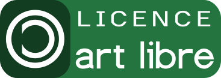
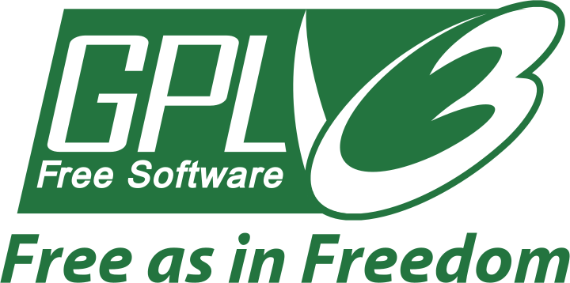
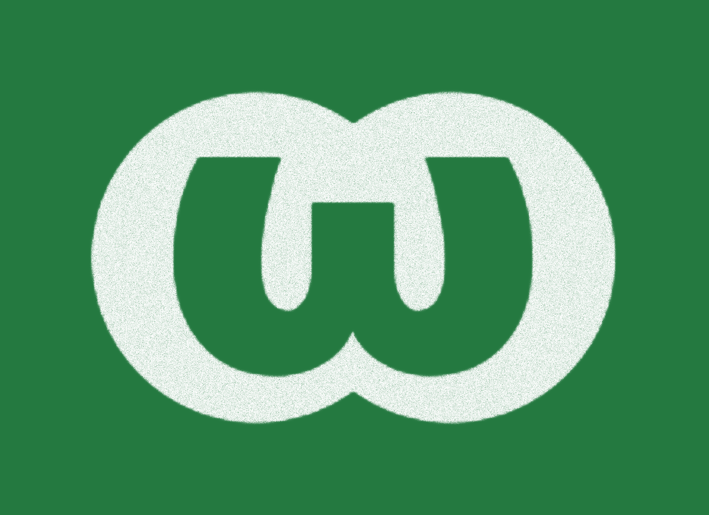
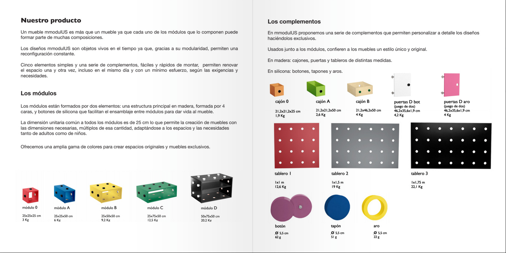
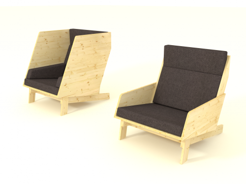
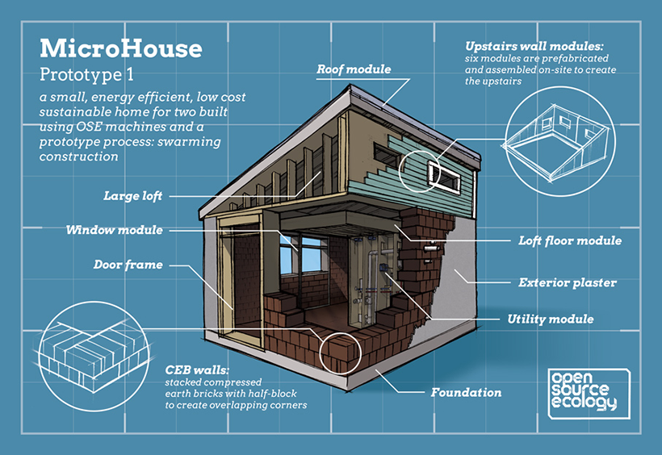

Licenses
=======

The first step in any open source design approach is to choose a license. This will condition every other step taken afterwards. The license is the social contract a designer is making with everyone else involved in the project. This contract, once set, is explicitly or implicitly signed by the other designers working on improving the project, by the manufacturers of the object and by its final users. This social contract is what differentiates open source product design from a more traditional approach.

Usually designers think about licensing once they start dealing with an editor or manufacturer, putting the choice of a license closer to the end of the design process. This contract usually benefits parties that know each other while it restricts any use beyond those not directly involved in the creation or build process. In this classical approach, the license is mainly a commercial agreement.

Open source design addresses this the other way around: choosing a license must be placed at the beginning of the process. The license is specifically made for parties that don't know each other. As an open source product designer, I don't know yet who will be involved in my project, who will build it or possibly even what purpose the object will be used for. The license can address commercial terms, but does not need to do so.

As with a classic contemporary design approach, licenses are made to protect the designer. But in open source design, these licenses are also made to protect the users or any other person in relation to the design. Today, more and more objects are given to you with restrictions on use, placing restrictions on how you can open and own those objects. Take a car for example, or a smart-phone. As a user you have very little say about how those things work, let alone the possibility to repair them when they are broken. And this is not only related to the technical knowledge to do so but also with the legal right to apply any modification.

Four freedoms
--------------------

Open source product design is a practice that comes from free/libre and open source software and as such follows the same principles, but applied to objects. There is an easy way to determine if a license is "open source" or not: does it respect the [4 freedoms](http://www.gnu.org/philosophy/free-sw.html )?

Here are those 4 freedoms applied to objects:

1. The freedom to use objects as you wish, for any purpose (freedom 0).
2. The freedom to study how the object works, freedom to build it and change it so it behaves as you wish (freedom 1). Access to documentation, build processes and sources are a precondition for this.
3. The freedom to redistribute the documentation, build processes, sources and copies of the object so you can help your neighbor (freedom 2).
4. The freedom to distribute copies of your modified versions to others (freedom 3). By doing this you can give the whole community a chance to benefit from your changes. Access to the documentation, build processes and sources are a precondition for this.

Commercial or Non-Commercial
----------------------------------------------

Many times, the question of the commercial exploitation of a design generates heated debates in the open source design community. We'd like to refer you to the section about economics to understand more about this, but we want to make clear here that any license that would prevent any commercial use of a design **does not comply** with the four freedoms. Why? Because this conflicts or puts limitations on the freedom 2 and 3.

If you license your project with a commercial restriction, it can't rightly be called "open source design". Instead, you might want to have a look at our "Proposition" section to find a better generic name for your project.

I don't need a license, I already share everything
-------------------------------------------------------------

People deeply involved in community activities are usually well versed at the practice of sharing and know the benefits of it. Because of this, they sometimes overlook the need for attaching a license to their work. And this is a big mistake.

By default, every creation is protected by copyright. So even if some work is shared freely among a group of user, at any point in time, the creators of that work could apply restrictions and claim compensations for the use of it. Not applying a license to some shared work means trusting that the creators won't change their mind later on. This is fine most of the time, until money or any form of compensation is involved. By attaching a clear license to your work, you can get those problems out of the way and trust that nobody will change their mind even over time.

Another undesired or unseen side effect of not using a license is that you will exclude a lot of people from participating and prevent people from spreading your work. Even if you've said that you want your work to be shared, if there is no license attached, people will have to contact you every time they want to do something special with it and ask you for a proper authorization. Licensing your work makes sharing faster and safer for everyone and requires less energy over time.

Copyright means that you have to ask the authors' permission for anything you want to do with their work. This is the default behavior. So if you really want people to do anything they want with your work, you have to **explicitly authorize it**, something that can only be done with a license.

Is there an ideal or perfect license for open source objects?
-------------------------------------------------------------------------------------

Sorry to say this, but no. Although there are many open source licenses for software and some of those licenses work for design documents, there is no magic solution that can work in any case. Remember that licenses are generally complex legal documents that try to cover as many cases as possible and that give guidelines on what is permitted or not. As we said, these are social contracts, and as such could be ideal in a particular situation, but could be problematic in others. In the case of open source licenses, since these grant more freedoms than they restrict, they generally tend to create less problems than some others. Fortunately also, and as open source product design becomes more and more popular, we can expect that licenses will improve and adapt to the new conditions brought by our future societies.

Please, refer to the "Tools" chapter of this section to have an overview of the licenses available and their use cases.

Terms of use and liability
-----------------------------------

Usually, when you acquire an object, some terms of use define the cases for which the object has been intended and limits the responsibility of the designer to those cases. It is commonly accepted that a designer is responsible for the creation and quality of the objects being produced following his technical plans. In most countries, designs have to go through extensive testing and have to follow local regulations before being put on the market.

With open source product design, the responsibility is often transfered to the person receiving the documentation and is totally removed from the creator's hand by the license. As with open source software, documentation and objects being offered have no guarantee of usability, functionality or purpose of any kind and the final user cannot consider the designer responsible for anything, including faults and errors.

Because of this, if you intend to download, build and commercialize any open source object, you should check your local regulations for the implications of such practices and get advice from a specialized lawyer.

Tools
-------

### [Free Art License](http://artlibre.org/licence/lal/en/ )

This is the prefered license used by Libre Objet members. This license was written by Antoine Moreau and friends and originated in France. The F.A.L. is very easy to read and simple to understand. It has been written especially for works of art regardless of their type or expression and is respectful of the roman version of the author's right (as opposed to the English copyright)

### [Creative Commons](https://creativecommons.org/licenses/ )

Surprise, surprise! Creative Commons is not a license. **It's a set of licenses**. We often hear: "_I publish my creations under Creative Commons_" as if this would instantly make you a nice person. It does not. Creative Commons offers licenses that range from total freedom to almost no freedom at all. Fortunately, due to their popularity, you will find countless texts that explain the use of each of the Creative Commons licenses. If you care about restricting some user rights, Creative Commons offers you that option. But remember, because of this, some of the Creative Commons licenses are not actually open source. Here are the licenses that you can be considered open source:  
- Attribution-Share Alike (CC-BY-SA)
- Attribution (CC-BY)
- Public Domain Dedication (CC0)

### [TAPR License](http://www.tapr.org/ohl.html )

The TAPR Open Hardware License is a license dedicated to open hardware projects, usually electronics components involved in amateur radio. This license could be applied to any objects and addresses the specificity of open sourcing physical objects.

### [CERN](http://www.ohwr.org/projects/cernohl/wiki )

> In the spirit of knowledge sharing and dissemination, the CERN Open Hardware License (CERN OHL) governs the use, copying, modification and  distribution of hardware design, documentation, and the manufacture and distribution of products.

### [GPL](https://gnu.org/licenses/gpl.html )

The Gnu General Public License is the mother of all open source licenses. It was created by Richard Stallman and has been used and released as early as 1989. This license is certainly the most popular license for free/libre and open source software, but it can also apply to the designs of objects.

### [WTFPL](http://www.wtfpl.net/ )

The "do What The Fuck you want Public License" is a very short and somewhat funny license that exists as a response to flame wars that often occur between partisans of one license or another.

But if you really don't give a fuss, you could be nicer to everyone by just dedicating your work to public domain through the use of a CC0 license or doing a direct public domain dedication if you're located in a country where it is permitted.

### [Peer Production License](http://p2pfoundation.net/Peer_Production_License )

The Peer Production License by John Magyar and Dmytri Kleiner is a very interesting take on the commercial or non-commercial debate that happens around open source product design. Basically, it cannot be considered an open source license as it restricts freedoms on uses and distribution, allowing only other commons-ers, cooperatives and nonprofits to share and re-use the material, but not commercial entities who intend to make profit through the commons without explicit reciprocity. To our knowledge so far, no designs have been released under this license.

### [FabL](https://lite6.framapad.org/p/FABL-0.1-incub-COMMENTAIRES )

The Fabrication License is a new license − in the making − especially dedicated to the cases brought by growing popularity of fablabs and open source design. This license is being developed around the same community that developed the Free Art License.

### More licences...

There are many more licenses that you could chose from. Some might be more suitable for documentation, or you could even write your own license. Keep in mind that a license is usually a legal document that both parties have to trust in order to engage in a collaboration.

In the end, the strength of a license will only be tested in case of conflicts and will be determined by a ruling from a judge.

Objects
-----------

### [Mmodulus](http://mmodulus.com/ )

Mmodulus, a series of modular furniture by Martina Minnucci and Juan Freire has been published using a CERN license.

### [Archipel armchair](http://libreobjet.org/objects/archipel-armchair/ )  

Archipel armchair , by Mathieu Gabiot, is an armchair published under the Free Art License.

### [MicroHouse](http://opensourceecology.org/portfolio/microhouse/ )

MicroHouse, by Open Source Ecology, is a small energy efficient low-cost house designed for two and has been released under a GPL License.

### [Mozilla Open Source Furniture](http://os-furnitures.tumblr.com/ )

Designed by Nosigner, elements that were used to compose the furniture for Mozilla's Japan office have been published under a CC-by license.

Food for thought
-----------------------

### Copyright

>  Copyright  is a legal right created by the law of a country that grants  the  creator of an original work exclusive rights for its use   and   distribution. This is usually only for a limited time. The   exclusive   rights are not absolute but limited by limitations and   exceptions to   copyright law, including fair use.

>  Copyright  is a form of intellectual **property**, applicable to  certain forms of  **creative work**. Under US copyright law, legal    protection attaches  only to fixed  representations in a tangible medium. It is often shared among   multiple  authors, each of whom holds a set of rights to use or license,  the work  and who are commonly referred to as rights-holders. These  rights  frequently include reproduction, control over derivative   works,   distribution, public performance, and "moral rights" such as  attribution.

>  Copyrights  are considered **territorial rights**, which means that   they do not  extend beyond the territory of a specific jurisdiction.  While many  aspects of national copyright laws have been standardized     through  international copyright agreements, copyright laws vary by    country.  
−[Wikipedia](https://en.wikipedia.org/wiki/Copyright)

### Copyleft

> Copyleft (a play on the word copyright)  is the practice of offering people the right to freely distribute   copies and modified versions of a work with the stipulation that the     same rights be preserved in derivative works down the line.

>  Copyleft  is a form of licensing, and can be used to maintain  copyright  conditions for works ranging from computer software, to    documents, to  art.  In general, copyright law is used by an author to    prohibit  recipients  from reproducing, adapting, or distributing   copies  of their  work. In  contrast, under copyleft, an author may  give  every  person who  receives a  copy of the work permission to   reproduce,  adapt,  or  distribute it, with the accompanying  requirement  that any  resulting   copies or adaptations are also bound  by the same  licensing  agreement.  
Copyleft  licenses for software **require that information necessary for reproducing and modifying the work must be made available to recipients of the binaries**. The source code files will usually    contain a copy of  the license terms and acknowledge the authors.
−[Wikipedia](https://en.wikipedia.org/wiki/Copyleft)

### Ronen Kadushin
Ronan Kadushin, in his [Open Design Manifesto](http://www.ronen-kadushin.com/files/4613/4530/1263/Open_Design_Manifesto-Ronen_Kadushin_.pdf ), considers that there are two requirements for open designs:
1. They have to be published under a CC license.
2. They have to be build using only CNC machines.

### [Open Structures](http://openstructures.net/ )
> The OS (OpenStructures) project explores the possibility of a modular construction model where **everyone designs for everyone** on the basis of one shared geometrical grid.

This approach of grid based designed applied to objects is very interesting and has produced intriguing objects, but it also shoots itself in the foot by not forcing anyone to use certain licenses that would give a legal framework to the "everyone for everyone" model.

### [IkeaHackers](http://www.ikeahackers.net/about )
The famous IkeaHackers website gets threatened for intellectual property infringement.
> Some months ago I received a Cease and Desist (C&D) letter from the agent of Inter IKEA Systems B.V., citing that my site IKEAhackers.net has infringed upon its intellectual property rights. [...]
> Long   story short, after much negotiation between their agent and my lawyer,  I  am allowed to keep the domain name IKEAhackers.net only on the   condition that it is non-commercial, meaning no advertising whatsoever.
> I agreed to that demand. Because the name IKEAhackers is very dear to me and I am soooo reluctant to give it up. I love this site’s community and what we have  accomplished in the last 8 years. Secondly, I don’t have deep enough pockets to fight a mammoth company in court."

Open questions
----------------------
- What is your preferred license and most importantly why?
- Should product designers write their own license?
- What limitations and opportunities exist in product design but not software design?
- What would be the physical representation of a license?
- How can we apply a license to an object?
